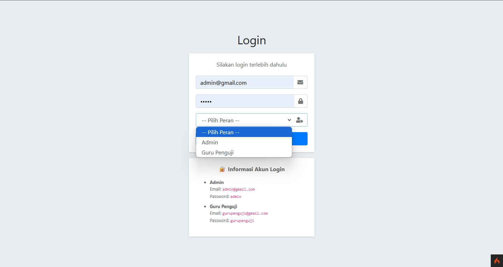
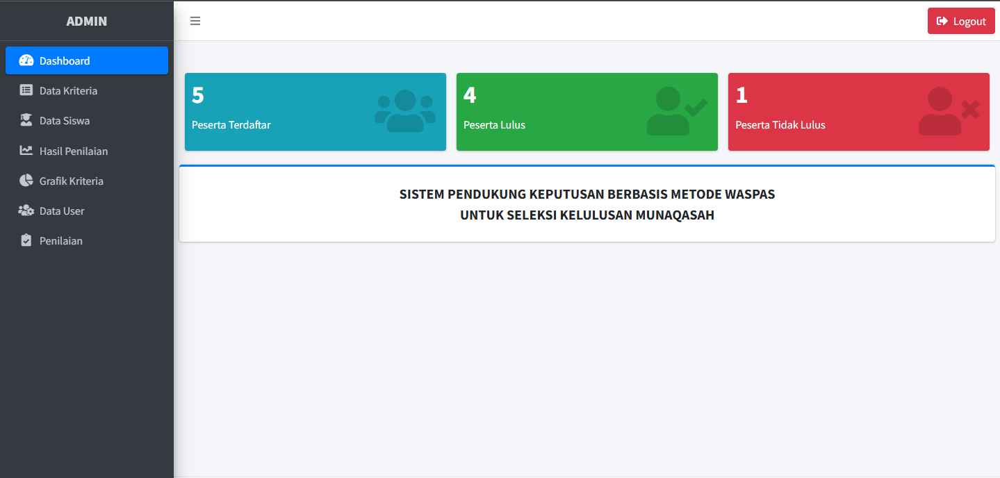
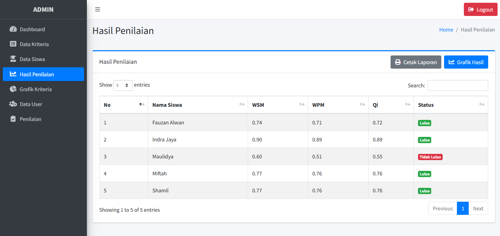

# SISTEM PENDUKUNG KEPUTUSAN METODE WASPAS

**Aplikasi Sistem Pendukung Keputusan (SPK) Berbasis Metode WASPAS untuk Seleksi Kelulusan Munaqashah**

## 📌 Deskripsi Singkat

Aplikasi ini membantu proses penilaian dan seleksi kelulusan siswa tahfidz menggunakan metode Weighted Aggregated Sum Product Assessment (WASPAS) dengan kriteria:

- Kelancaran Membaca
- Waktu
- Tajwid
- Makhrojul Huruf

Dengan bobot kriteria dan perhitungan normalisasi serta hasil akhir berupa nilai WSM, WPM, dan Qi.

## 🖥️ Tampilan Aplikasi

Berikut adalah beberapa tampilan dari aplikasi:

### Halaman Login



### Halaman Dashboard



### Halaman Hasil Penilaian



## ⚙️ Persyaratan Sistem

- PHP 8.x ke atas
- Composer
- MySQL
- Ekstensi PHP Zip aktif

### Cara Mengaktifkan Ekstensi ZIP:

**XAMPP:**

- Buka `php.ini`
- Cari `;extension=zip` lalu hapus tanda `;` menjadi `extension=zip`
- Restart Apache

**Laragon:**

- Klik kanan tray icon > PHP > php.ini
- Lakukan hal yang sama seperti di atas

## 🚀 Cara Menjalankan Proyek

1. Clone repository ini
2. Buat database dengan nama `db_spk_waspas` (bisa diganti di `.env`)
3. Jalankan migrasi:
   ```bash
   php spark migrate
   ```
4. Jalankan seeder untuk data awal:
   ```bash
   php spark db:seed DefaultSeeder
   ```
5. Jalankan server lokal:
   ```bash
   php spark serve
   ```
6. Buka browser dan akses: `http://localhost:8080`

## 👥 Akun Login Default

| Role         | Email                 | Password    |
| ------------ | --------------------- | ----------- |
| Admin        | admin@gmail.com       | admin       |
| Guru Penguji | gurupenguji@gmail.com | gurupenguji |

---

## 🔍 Keywords SEO

```
SPK Tahfidz Qur'an, WASPAS CodeIgniter 4, Sistem Pendukung Keputusan, Munaqashah Qur'an, Seleksi Siswa Tahfidz, CI4 SPK WASPAS, Metode WASPAS Tahfidz
```

### 📌 Credits

This project is developed and maintained by [Masmut Dev](https://masmutdev.com), a Fullstack Developer with expertise in UI/UX design and DevOps engineering. Passionate about building intelligent systems, clean interfaces, and scalable infrastructures.

© 2025 [Masmut Dev](https://masmutdev.com) – All Rights Reserved.

Lisensi: MIT
